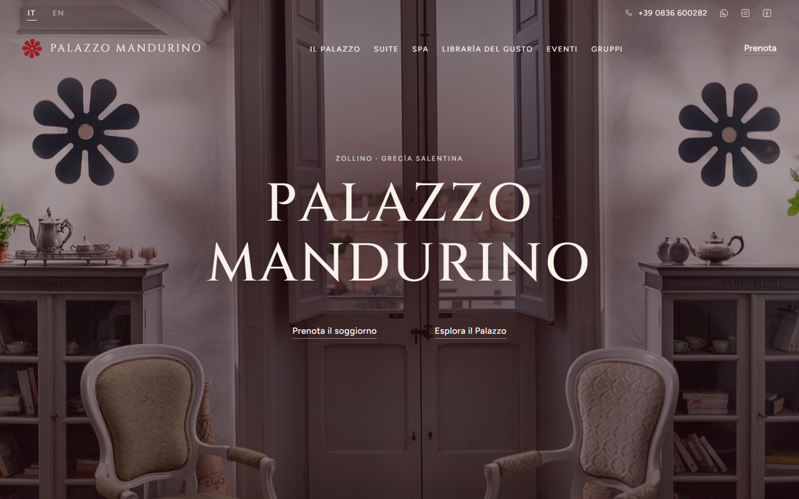

### Ciao, sono Luca

Progetto e sviluppo **siti web** per strutture ricettive e realtà del territorio, in Salento.
Mi occupo di tutto il percorso: design, codice, testi in più lingue, e un pannello con
cui chi gestisce la struttura aggiorna il sito da solo.

---

#### Progetto in evidenza

**[Palazzo Mandurino](https://github.com/cinquanta0/palazzo-mandurino-sito)** — dimora storica
con suite, spa e ristorante a Zollino. Sito bilingue rifatto da zero al posto di un
WordPress compromesso, con pannello di gestione per la proprietà, nessun tracciamento
di terze parti e accessibilità AA.
[Vedi il sito →](https://mellifluous-granita-c62e23.netlify.app/)

---

#### Strumenti

Astro · Tailwind CSS · React · Decap CMS · Netlify · Playwright · Git

Web developer based in Salento, Italy — I design and build websites for hospitality and local businesses.
